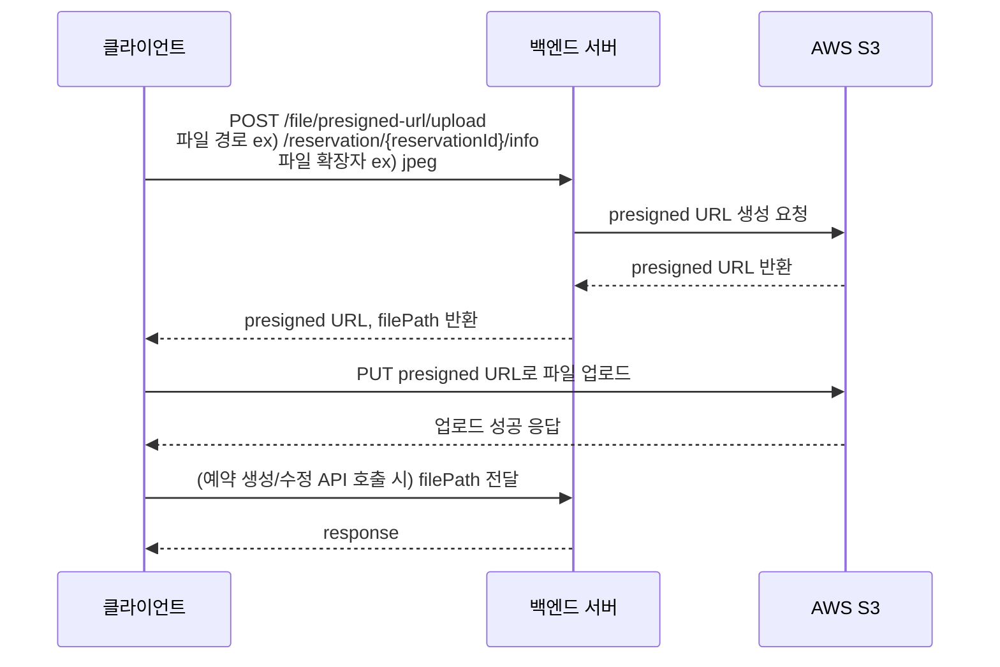
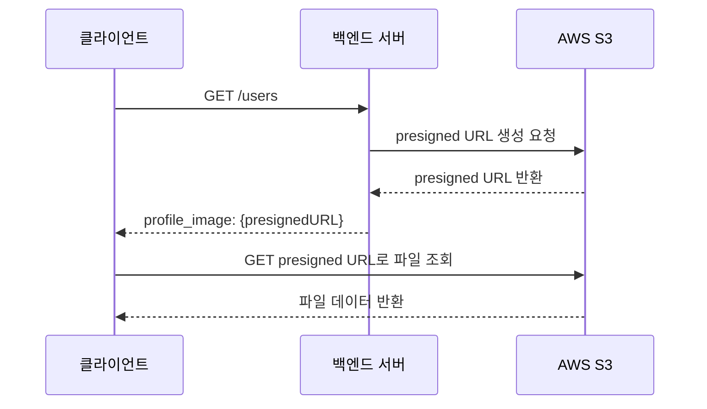

# Files

## 개요

- 파일 첨부를 위해 AWS S3를 사용합니다.

## 주요 기능 및 설계

- 백엔드에서는 `presigned URL`을 생성하여 클라이언트에 전달합니다.
- 실제 파일 업로드/다운로드는 클라이언트에서`presigned URL`을 사용하여 진행합니다.
  - presigned URL 생성을 위한 백엔드 API : POST
  - presigned URL로 파일 업로드 시 : PUT
  - presigned URL로 파일 다운로드 시 : GET

### API

- `POST /file/presigned-url/upload`을 통해 파일 업로드를 위한 `presigned URL`을 생성합니다.
  - 파일 종류별로 다른 path가 부여됩니다.
  - 두 종류의 path를 사용할 수 있습니다.
    - 예약 이미지 : /reservations/{reservation_id}/info
    - 예약 결과 이미지 : /reservations/{reservation_id}/result
- `POST /file/presigned-url/access`을 통해 파일 조회/다운로드를 위한 `presigned URL`을 생성합니다.
  - 모든 파일이 공통된 API를 사용합니다.

### 파일 업로드 플로우 예시

예약 사진 등록

1. 클라이언트에서 `POST/file/presigned-url/upload`을 호출합니다.
   - body에 /reservations/{reservation_id}/info를 담아서 호출
2. 백엔드에서 `presigned URL`을 생성하여 클라이언트에 전달합니다.
   - 이 때, filePath가 함께 response됩니다. (1)
     - ex) `filePath: /reservations/{reservation_id}/info/{uuid}.jpg"`
3. 클라이언트에서 `presigned URL`을 사용하여 PUT호출을 통해 파일을 업로드합니다.
4. 예약 생성 or 예약 정보 업데이트 업데이트 API 호출 시, `filePath`(1)를 전달합니다.

### 파일 조회 플로우 예시

프로필 이미지 조회

1. 유저 정보 조회 API를 통해, profile image path를 전달받습니다.
   - 예시 : /users/profile/profile_01.png
2. 클라이언트에서 profile image path를 이용해 `POST /file/presigned-url/access`을 호출합니다.
3. 백엔드에서 `presigned URL`을 생성하여 클라이언트에 전달합니다.
4. 클라이언트에서 `presigned URL`을 사용하여 GET호출을 통해 파일을 조회/다운로드합니다.

